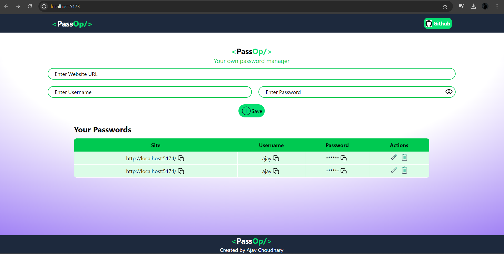

# 🔐 Password Manager (MERN Stack)

A secure password manager built using *React, **Express, **Node.js, and **MongoDB. This app allows users to **store, **retrieve, **edit, and **delete* their login credentials for various platforms in an encrypted format.

---

## 🚀 Features

- 🧠 Store and manage multiple passwords
- 🔄 Edit and delete saved credentials
- 📱 Responsive UI with modern design
- 💬 Toast alerts & validations

---

## 🛠 Tech Stack

- *Frontend*: React, Axios, Tailwind CSS 
- *Backend*: Node.js, Express.js
- *Database*: MongoDB (using Mongoose)

---

## 📷 Screenshots

  
---

